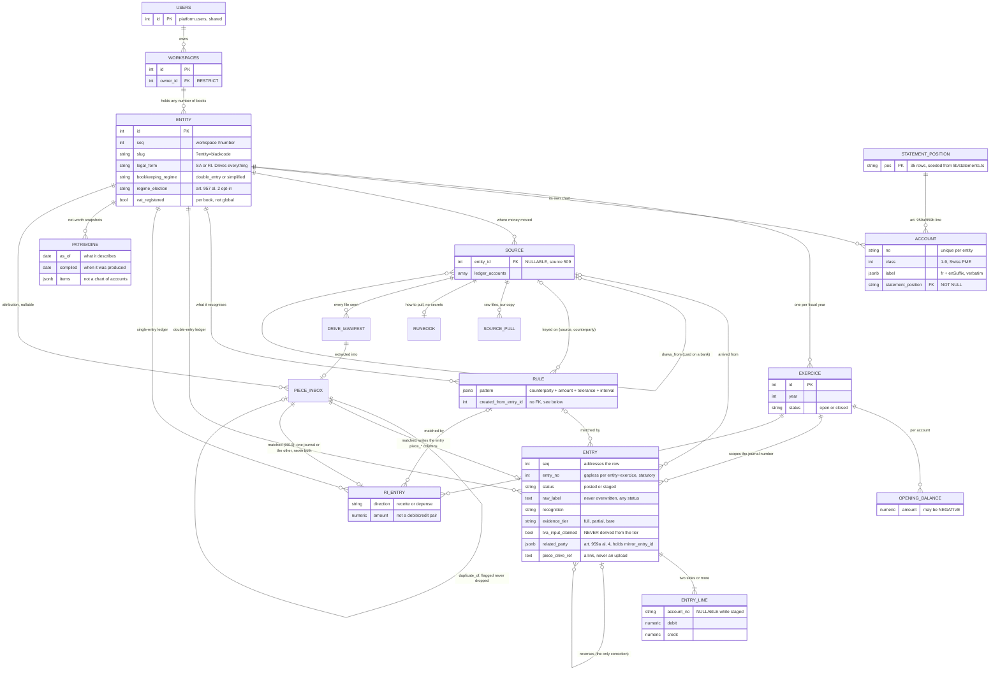

# b/books — backend

**This app only.** Shared API conventions are in the root
[`docs/backend.md`](../../../docs/backend.md), the database boundary and the role
model in [`docs/platform-db.md`](../../../docs/platform-db.md). Neither is
repeated here.

**Status: IN PRODUCTION since 2026-08-20** at `books.blackcode.ch`.

Everything through the management layer, plus COMPLIANCE: the Fedlex-researched
rules served globally with citations and `review_state` (all DRAFT until the
fiduciary signs off — `PATCH /compliance-rules/{rule}` records approve/edit/reject,
permanently), the Devil's Advocate's verdict door (`POST /entries/{n}/verdict`,
structured `{verdict, rules, worst_case, resolves}`, history-first, both journals),
and exactly ONE enforcement: a `blocked` entry refuses to post. The footprint
answers the account-close flow honestly — a workspace whose books hold records is
`blocked_by` and purge refuses citing art. 958f CO; the account may close, the
books stay. DATA-MODEL §17 is an audited checklist in `lib/invariants.test.ts`.

Still open, and both are real: the statutory PDF export (a print-stylesheet task
over the already-bilingual statements), and a write door for `patrimoine`, which
today can be read and never recorded.

What each phase added is in [`docs/books-app-plan/`](../../../docs/books-app-plan/README.md).

**Migrations applied: 19 of 19**, `__drizzle_migrations_books`. `0015`–`0019`
landed after the sentence above was first written, and each changed something a
caller can see:

| Migration | What it changed |
|---|---|
| `0015_piece_sha256` | `piece_inbox.sha256`, and a UNIQUE index on `(file_id, sha256)`. The dedupe key was the file id alone, so the SECOND capture of a re-issued invoice was mistaken for a retry and silently dropped. A pièce with no checksum has an empty key and cannot be told apart from the next one — which is why the ingest door now refuses a delivery without one |
| `0016_year_close_guards` | Three triggers: a closed `exercice` cannot be reopened or have its dates or book changed, a closed year's `opening_balance` rows are frozen, and an `entry_line` may not name an account outside that book's chart. See §3 |
| `0017_compliance_rules_reference` | The researched rule set, seeded as data with its citations, severities and `source_confidence`. Rules are the APP's, not a book's: no `entity_id`, and `applies_to` says which legal form each bites on |
| `0018_pull_closing_balance` | `source_pull.closing_balance` / `closing_on` — what the bank SAID this statement closed at. It is what makes `bk books source show`'s reconciliation able to distinguish a drift from an unknown; without it a source that has never stated a balance agreed with everything |
| `0019_source_import_mapping` | `source.import_mapping` (the delimited reader's column map, per issuer) and an index on `draws_from`. There is no "CSV format": every issuer names its columns differently, so the mapping is DATA established once from a real export, not code |

---

## 1. The schema

Drawn from the live database, not from the migration files. Every relationship
below is a real foreign key.



## 2. The five relationships worth arguing about

**A workspace holds any number of books.** A book is not a workspace. The
deciding case is source 503, the Yapeal card: one physical card on blackcode SA
whose individual spends are attributed to different entities at import. D1 in the
plan's README has the argument in full.

**`related_party.mirror_entry_id` crosses books.** An inter-company loan appears
in both companies' ledgers and art. 959a al. 4 requires separate presentation.
That relationship is only expressible because one workspace holds every book.

**`source.draws_from` is a self-reference.** A Yapeal card draws on the WIR
account. Phase 3 builds the three-layer hierarchy on it; phase 1 keeps the column
because dropping it would lose a stated fact.

**`entry.reverses_entry_id` is the only correction path.** `RESTRICT`, so a
reversed entry cannot be removed from under its reversal.

**`rule.created_from_entry_id` has no foreign key, deliberately.**
`entry.matched_rule_id` already points at `rule`, so the reverse edge would be
circular and needs an `ALTER TABLE` after both exist. It is provenance, entries
are never hard-deleted, and a dangling value here is preferable to a migration
ordering trick. Recorded so the next reader knows it was decided, not forgotten.

## 3. The guards, and what each refuses

All are database objects. See [`0004_statutory_guards.sql`](../lib/db/migrations/0004_statutory_guards.sql).

| Guard | Refuses |
|---|---|
| Balanced lines | Posting when debit ≠ credit, or fewer than two lines |
| Accounts on posting | Posting with any line whose `account_no` is null |
| Accounting facts frozen | Changing entity, exercice, `entry_no`, date, `seq`, VAT rate or amount on a posted entry. Un-posting. Any delete, hard or soft |
| `raw_label` | Overwriting it, at **every** status |
| Lines frozen | Adding, changing or removing a line on a posted entry |
| No hard delete | `DELETE` on `entry` or `ri_entry`, at any status (art. 958f) |
| Capital company | An SA or Sàrl with `bookkeeping_regime = 'simplified'` (art. 957 al. 1 ch. 2) |
| Input VAT | `tva_input_claimed = true` on anything but `full` evidence (art. 26 LTVA) |
| Statement position | An account mapped to a line that is not law |
| One side per line | A line carrying both a debit and a credit |

### 3.1 Posting is a transition, never an initial state

An entry cannot be inserted as `posted` and then given lines: the line trigger
refuses them. The flow is insert `staged`, add lines, `UPDATE` to `posted`, which
is when the deferred balance check fires.

That is the correct accounting model, and it also means every posted entry was
staged first, so the journal has a real before state. Found by probing rather
than by design: the first version of 0004 made creating a posted entry impossible
in a way no test would have caught until the seed ran.

### 3.2 "Immutable" is column-scoped, and that is not a weakening

The plan says posted rows are immutable, block `UPDATE` and `DELETE`. Taken
literally it breaks the app.

Mockup entry 1009 is posted, balanced, and `unrecognized`, and its own verdict
block states the intended next step: identify the counterparty, and the evidence
tier moves from `bare` to `partial`. That is an update of a posted row and it is
the Reconnaissance screen's entire purpose.

So money that moved is frozen, and what it MEANT stays open: `counterparty`,
`explanation`, `recognition`, `matched_rule_id`, `evidence_tier`,
`evidence_note`, `related_party`, the pièce, `history`, and
`tva_input_claimed`. A table-level `REVOKE UPDATE` cannot tell the date of an
entry from its explanation; the triggers can.

### 3.3 Run the probe before trusting any of this

```sh
docker exec -i blackcode-postgres psql -U blackcode -d blackcode_issues -q \
  < docs/sql/books-guard-probe.sql
```

Nineteen assertions. **Three of them assert that something SUCCEEDS**, and those
are the ones that matter: a staged entry with no account, resolving a posted
entry, and an RI keeping simplified books. Without them the probe cannot tell a
working guard from a blanket refusal.

That is not hypothetical. The phase 0 app-boundary probe passed on 2026-08-17
while `books_app` held no privilege on any table in its own schema, because every
check in it was a negative and a subject that can do nothing passes all of them.

**The probe is not in `npm test` yet.** Until it is, nothing catches a migration
that weakens a guard.

## 4. The app role

`books_app` holds DML and owns nothing. Verified 2026-08-17 in both directions: it
can stage, line, post and resolve an entry, and it cannot delete an entry, add a
statement position, or create a table.

`DELETE` is revoked on `entry`, `entry_line`, `ri_entry`, `patrimoine`, `account`,
`opening_balance` and `exercice`, by privilege **and** by trigger. The trigger
stops anything running as owner; the revoke shows up in `\dp` where a reviewer
sees it.

`books.statement_position` is `SELECT` only. The law is not runtime-editable.

> **`docs/sql/books-app-role.sql` exists** — written because the generic template
> could not be used as it stands. `docs/sql/app-role.sql` says to substitute
> `<app>`, but carries literal `issues` and `issues_app` in the second half,
> including the `ALTER DEFAULT PRIVILEGES` that was meant to cover FUTURE tables.
> Run unsubstituted for a new app it silently reconfigures issues, which is why
> `books_app` had no privileges until `0005`. Two rules, both learned here:
> **never run that template unsubstituted**, and **run it AFTER the first
> migration has created the schema** — every grant names a schema the file does
> not create, and `psql` exits 0 having skipped the ones that failed (CLAUDE.md
> finding #15). Each app's substituted copy lives beside it:
> `sales-app-role.sql`, `books-app-role.sql`.

## 5. Money and dates on the wire

`numeric(14,2)`, never float, and it crosses the wire as a **string**. A bilan
balances to the rappen and binary floating point cannot represent 0.10. This
diverges from the mockup's raw JSON numbers deliberately; see
[`frontend.md`](./frontend.md) §6.

Dates are `date` columns and ISO date strings. No `Date` object anywhere in the
render path, because a timezone applied to a booking date moves it a day.

## 6. Two numbers per entry, and they are not interchangeable

`seq` is the platform workspace-scoped #number. It addresses a row, it is what
`bk books entry show 42` takes and what a URN carries, and it spans books and
years.

`entry_no` is the statutory journal number: gapless, scoped to
`(entity, exercice)`, which is what a tax authority reads. Gaplessness per year is
a legal property and `seq` cannot provide it.

The serial `id` is never exposed anywhere.

## 7. Bilingual columns — what is stored, and what crosses the wire

This app renders EN and FR (`packages/platform-i18n`, and the preference is
`platform.users.locale`, shared). Three kinds of text are involved and only the
middle one is a database concern:

- **Interface copy** — buttons, headings, empty states. It is NOT here. It lives
  in this app's own dictionary and never in the shared package; the mechanism is
  shared, the words are not.
- **Stored speech** — `StoredSpeech = string | { fr?: string; en?: string }`
  (`lib/db/schema.ts`). It is what a human or an agent WROTE: an entry's
  `explanation`, an analysis's labels, a history event's words. The union is
  deliberate — rows written before the language switch carry a bare string, and
  a migration that wrapped them would be inventing a language for text nobody
  said which language it was in. Read it through the helper that falls back
  rather than by indexing the object.
- **Statutory wording** — an account's `label`, a statement position's name.
  These are LAW, not interface copy: the French is the wording that has to
  survive, so it is stored and never translated at render time. The column keeps
  the mockup's own `{ fr, enSuffix }` shape and the WIRE normalizes it to
  `{ fr, en }` at the door, so no client has to know the storage shape. The CLI
  prints the French.

The order, the French labels and the signs of the statement lines stay in code
(`lib/statements.ts`); only the SET of legal keys is a table.

## 8. The account surface lives here too (2026-08-19)

b/books serves the whole account surface the other two apps have — register,
edit profile, forgot/reset password, change password, mint and revoke API
tokens, the browser half of `bk login`, and the language preference. Every one of
them writes `platform.{users,password_reset_otps,api_tokens}` and **not one
touches `books.*`**.

That matters for the read-only guard rather than for the schema.
`lib/read-only.test.ts` says a write comes from a named module or the suite is
red, and there are exactly two such modules: `lib/mutations.ts` for this app's
own data, and `lib/account.ts` for the account. Putting an account write into the
first would make it "one of the five writes", which it is not; letting a
component call `apiSend` directly deletes the guard outright.

The test for where a new write belongs is one question: **does it touch
`books.*`?**
