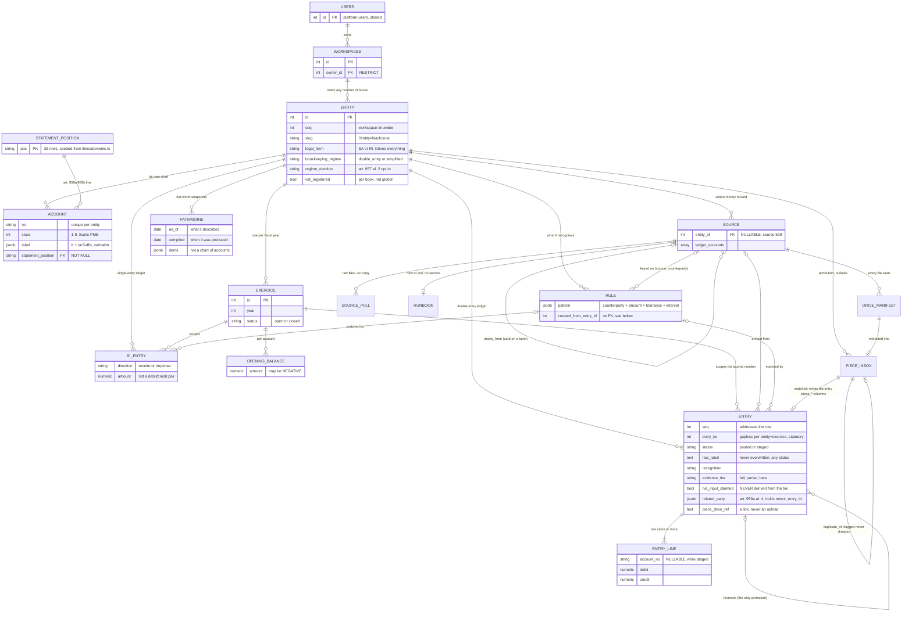

# b/books — backend

**This app only.** Shared API conventions are in the root
[`docs/backend.md`](../../../docs/backend.md), the database boundary and the role
model in [`docs/platform-db.md`](../../../docs/platform-db.md). Neither is
repeated here.

**Status: phase 3, 2026-08-18.** The statutory core, recognition, the sources register and the pièces pipeline exist and are migrated (0001-0009).
No derivations, no queries, no routes beyond `/api/meta` yet. What each phase adds
is in [`docs/books-app-plan/`](../../../docs/books-app-plan/README.md).

Migrations applied: 5 of 5, `__drizzle_migrations_books`.

---

## 1. The schema

Drawn from the live database, not from the migration files. Every relationship
below is a real foreign key.



## 2. The five relationships worth arguing about

**A workspace holds any number of books.** A book is not a workspace. The
deciding case is source 503, the Yapeal card: one physical card on blackcode SA
whose individual spends are attributed to different entities at import. D1 in the
plan's README has the argument in full.

**`related_party.mirror_entry_id` crosses books.** An inter-company loan appears
in both companies' ledgers and art. 959a al. 4 requires separate presentation.
That relationship is only expressible because one workspace holds every book.

**`source.draws_from` is a self-reference.** A Yapeal card draws on the WIR
account. Phase 3 builds the three-layer hierarchy on it; phase 1 keeps the column
because dropping it would lose a stated fact.

**`entry.reverses_entry_id` is the only correction path.** `RESTRICT`, so a
reversed entry cannot be removed from under its reversal.

**`rule.created_from_entry_id` has no foreign key, deliberately.**
`entry.matched_rule_id` already points at `rule`, so the reverse edge would be
circular and needs an `ALTER TABLE` after both exist. It is provenance, entries
are never hard-deleted, and a dangling value here is preferable to a migration
ordering trick. Recorded so the next reader knows it was decided, not forgotten.

## 3. The guards, and what each refuses

All are database objects. See [`0004_statutory_guards.sql`](../lib/db/migrations/0004_statutory_guards.sql).

| Guard | Refuses |
|---|---|
| Balanced lines | Posting when debit ≠ credit, or fewer than two lines |
| Accounts on posting | Posting with any line whose `account_no` is null |
| Accounting facts frozen | Changing entity, exercice, `entry_no`, date, `seq`, VAT rate or amount on a posted entry. Un-posting. Any delete, hard or soft |
| `raw_label` | Overwriting it, at **every** status |
| Lines frozen | Adding, changing or removing a line on a posted entry |
| No hard delete | `DELETE` on `entry` or `ri_entry`, at any status (art. 958f) |
| Capital company | An SA or Sàrl with `bookkeeping_regime = 'simplified'` (art. 957 al. 1 ch. 2) |
| Input VAT | `tva_input_claimed = true` on anything but `full` evidence (art. 26 LTVA) |
| Statement position | An account mapped to a line that is not law |
| One side per line | A line carrying both a debit and a credit |

### 3.1 Posting is a transition, never an initial state

An entry cannot be inserted as `posted` and then given lines: the line trigger
refuses them. The flow is insert `staged`, add lines, `UPDATE` to `posted`, which
is when the deferred balance check fires.

That is the correct accounting model, and it also means every posted entry was
staged first, so the journal has a real before state. Found by probing rather
than by design: the first version of 0004 made creating a posted entry impossible
in a way no test would have caught until the seed ran.

### 3.2 "Immutable" is column-scoped, and that is not a weakening

The plan says posted rows are immutable, block `UPDATE` and `DELETE`. Taken
literally it breaks the app.

Mockup entry 1009 is posted, balanced, and `unrecognized`, and its own verdict
block states the intended next step: identify the counterparty, and the evidence
tier moves from `bare` to `partial`. That is an update of a posted row and it is
the Reconnaissance screen's entire purpose.

So money that moved is frozen, and what it MEANT stays open: `counterparty`,
`explanation`, `recognition`, `matched_rule_id`, `evidence_tier`,
`evidence_note`, `related_party`, the pièce, `history`, and
`tva_input_claimed`. A table-level `REVOKE UPDATE` cannot tell the date of an
entry from its explanation; the triggers can.

### 3.3 Run the probe before trusting any of this

```sh
docker exec -i blackcode-postgres psql -U blackcode -d blackcode_issues -q \
  < docs/sql/books-guard-probe.sql
```

Nineteen assertions. **Three of them assert that something SUCCEEDS**, and those
are the ones that matter: a staged entry with no account, resolving a posted
entry, and an RI keeping simplified books. Without them the probe cannot tell a
working guard from a blanket refusal.

That is not hypothetical. The phase 0 app-boundary probe passed on 2026-08-17
while `books_app` held no privilege on any table in its own schema, because every
check in it was a negative and a subject that can do nothing passes all of them.

**The probe is not in `npm test` yet.** Until it is, nothing catches a migration
that weakens a guard.

## 4. The app role

`books_app` holds DML and owns nothing. Verified 2026-08-17 in both directions: it
can stage, line, post and resolve an entry, and it cannot delete an entry, add a
statement position, or create a table.

`DELETE` is revoked on `entry`, `entry_line`, `ri_entry`, `patrimoine`, `account`,
`opening_balance` and `exercice`, by privilege **and** by trigger. The trigger
stops anything running as owner; the revoke shows up in `\dp` where a reviewer
sees it.

`books.statement_position` is `SELECT` only. The law is not runtime-editable.

> **`docs/sql/books-app-role.sql` is owed.** `docs/sql/app-role.sql` says to
> substitute `<app>` but carries literal `issues` and `issues_app` in lines 82 to
> 109, including the `ALTER DEFAULT PRIVILEGES` that was meant to cover future
> tables. Running it for a new app silently configures issues, which is why
> `books_app` had no privileges until 0005. Do not run that template unsubstituted
> against production.

## 5. Money and dates on the wire

`numeric(14,2)`, never float, and it crosses the wire as a **string**. A bilan
balances to the rappen and binary floating point cannot represent 0.10. This
diverges from the mockup's raw JSON numbers deliberately; see
[`frontend.md`](./frontend.md) §6.

Dates are `date` columns and ISO date strings. No `Date` object anywhere in the
render path, because a timezone applied to a booking date moves it a day.

## 6. Two numbers per entry, and they are not interchangeable

`seq` is the platform workspace-scoped #number. It addresses a row, it is what
`bk books entry show 42` takes and what a URN carries, and it spans books and
years.

`entry_no` is the statutory journal number: gapless, scoped to
`(entity, exercice)`, which is what a tax authority reads. Gaplessness per year is
a legal property and `seq` cannot provide it.

The serial `id` is never exposed anywhere.
