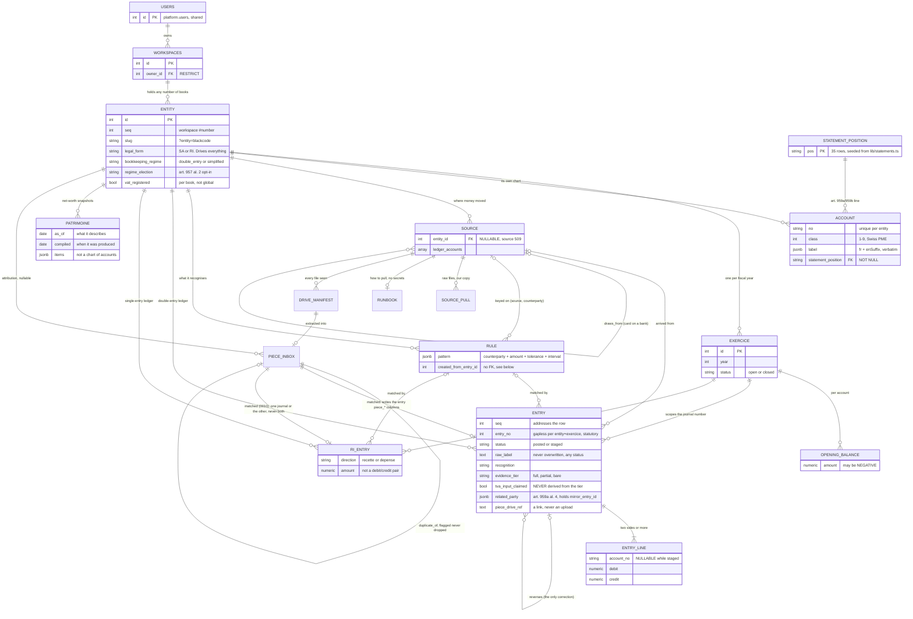

# b/books — backend

**This app only.** Shared API conventions are in the root
[`docs/backend.md`](../../../docs/backend.md), the database boundary and the role
model in [`docs/platform-db.md`](../../../docs/platform-db.md). Neither is
repeated here.

**Status: IN PRODUCTION since 2026-08-20** at `books.blackcode.ch`.

Everything through the management layer, plus COMPLIANCE: the Fedlex-researched
rules served globally with citations and `review_state` (all DRAFT until the
fiduciary signs off — `PATCH /compliance-rules/{rule}` records approve/edit/reject,
permanently), the Devil's Advocate's verdict door (`POST /entries/{n}/verdict`,
structured `{verdict, rules, worst_case, resolves}`, history-first, both journals),
and exactly ONE enforcement: a `blocked` entry refuses to post. The footprint
answers the account-close flow honestly — a workspace whose books hold records is
`blocked_by` and purge refuses citing art. 958f CO; the account may close, the
books stay. DATA-MODEL §17 is an audited checklist in `lib/invariants.test.ts`.

Still open, and both are real: the statutory PDF export (a print-stylesheet task
over the already-bilingual statements), and a write door for `patrimoine`, which
today can be read and never recorded.

What each phase added is in [`docs/books-app-plan/`](../../../docs/books-app-plan/README.md).

**Migrations applied: 21 of 21**, `__drizzle_migrations_books`. `0015`–`0020`
landed after the sentence above was first written, and each changed something a
caller can see:

| Migration | What it changed |
|---|---|
| `0015_piece_sha256` | `piece_inbox.sha256`, and a UNIQUE index on `(file_id, sha256)`. The dedupe key was the file id alone, so the SECOND capture of a re-issued invoice was mistaken for a retry and silently dropped. A pièce with no checksum has an empty key and cannot be told apart from the next one — which is why the ingest door now refuses a delivery without one |
| `0016_year_close_guards` | Three triggers: a closed `exercice` cannot be reopened or have its dates or book changed, a closed year's `opening_balance` rows are frozen, and an `entry_line` may not name an account outside that book's chart. See §3 |
| `0017_compliance_rules_reference` | The researched rule set, seeded as data with its citations, severities and `source_confidence`. Rules are the APP's, not a book's: no `entity_id`, and `applies_to` says which legal form each bites on |
| `0018_pull_closing_balance` | `source_pull.closing_balance` / `closing_on` — what the bank SAID this statement closed at. It is what makes `bk books source show`'s reconciliation able to distinguish a drift from an unknown; without it a source that has never stated a balance agreed with everything |
| `0019_source_import_mapping` | `source.import_mapping` (the delimited reader's column map, per issuer) and an index on `draws_from`. There is no "CSV format": every issuer names its columns differently, so the mapping is DATA established once from a real export, not code |
| `0020_books_remembers_a_workspace` | `books.user_settings(user_id, active_workspace_id)` — the workspace a person last chose. Until then `setDefaultForUser` was a no-op and `POST /api/me/active-workspace` stored nothing; `platform.users.active_workspace_id` is read by every deployment, so a books id cannot go there. Pointer `ON DELETE SET NULL`; the reader re-checks membership. See §10 |
| `0021_books_workspace_logo` | `books.workspaces.logo_url`, and its `trg_blob_refs_logo` trigger (`blob_refs_sync('books','workspace_logo','id','exact','logo_url')`) in the same file — the first file ever held in a books column, set only through the logo-only `POST/DELETE /api/workspaces/{ws}/logo`. Also re-asserts `platform.apps.maintains_blob_index = true`: 0002's UPDATE matches nothing if the app is registered after it runs, and a local database was found with it false |

---

## 1. The schema

Drawn from the live database, not from the migration files. Every relationship
below is a real foreign key.


```mermaid
erDiagram
  USERS      ||--o{ WORKSPACES : owns
  WORKSPACES ||--o{ ENTITY : "holds any number of books"

  ENTITY   ||--o{ EXERCICE : "one per fiscal year"
  ENTITY   ||--o{ ACCOUNT : "its own chart"
  ENTITY   ||--o{ SOURCE : "where money moved"
  ENTITY   ||--o{ RULE : "what it recognises"
  ENTITY   ||--o{ ENTRY : "double-entry ledger"
  ENTITY   ||--o{ RI_ENTRY : "single-entry ledger"
  ENTITY   ||--o{ PATRIMOINE : "net-worth snapshots"

  EXERCICE ||--o{ OPENING_BALANCE : "per account"
  EXERCICE ||--o{ ENTRY : "scopes the journal number"
  EXERCICE ||--o{ RI_ENTRY : scopes

  ENTRY    ||--|{ ENTRY_LINE : "two sides or more"
  ENTRY    |o--o{ ENTRY : "reverses (the only correction)"
  SOURCE   |o--o{ ENTRY : "arrived from"
  SOURCE   |o--o{ SOURCE : "draws_from (card on a bank)"
  RULE     |o--o{ ENTRY : "matched by"
  RULE     |o--o{ RI_ENTRY : "matched by"
  SOURCE   |o--o{ RULE : "keyed on (source, counterparty)"

  STATEMENT_POSITION ||--o{ ACCOUNT : "art. 959a/959b line"

  SOURCE ||--o{ SOURCE_PULL : "raw files, our copy"
  SOURCE ||--o| RUNBOOK : "how to pull, no secrets"
  SOURCE ||--o{ DRIVE_MANIFEST : "every file seen"
  ENTITY ||--o{ PIECE_INBOX : "attribution, nullable"
  PIECE_INBOX ||--o| PIECE_INBOX : "duplicate_of, flagged never dropped"
  PIECE_INBOX ||--o| ENTRY : "matched: writes the entry piece_* columns"
  PIECE_INBOX ||--o| RI_ENTRY : "matched (0010): one journal or the other, never both"
  DRIVE_MANIFEST ||--o| PIECE_INBOX : "extracted into"

  USERS {
    int id PK "platform.users, shared"
  }
  WORKSPACES {
    int id PK
    int owner_id FK "RESTRICT"
  }
  ENTITY {
    int id PK
    int seq "workspace #number"
    string slug "?entity=blackcode"
    string legal_form "SA or RI. Drives everything"
    string bookkeeping_regime "double_entry or simplified"
    string regime_election "art. 957 al. 2 opt-in"
    bool vat_registered "per book, not global"
  }
  EXERCICE {
    int id PK
    int year
    string status "open or closed"
  }
  ACCOUNT {
    string no "unique per entity"
    int class "1-9, Swiss PME"
    jsonb label "fr + enSuffix, verbatim"
    string statement_position FK "NOT NULL"
  }
  OPENING_BALANCE {
    numeric amount "may be NEGATIVE"
  }
  SOURCE {
    int entity_id FK "NULLABLE, source 509"
    array ledger_accounts
  }
  RULE {
    jsonb pattern "counterparty + amount + tolerance + interval"
    int created_from_entry_id "no FK, see below"
  }
  ENTRY {
    int seq "addresses the row"
    int entry_no "gapless per entity+exercice, statutory"
    string status "posted or staged"
    text raw_label "never overwritten, any status"
    string recognition
    string evidence_tier "full, partial, bare"
    bool tva_input_claimed "NEVER derived from the tier"
    jsonb related_party "art. 959a al. 4, holds mirror_entry_id"
    text piece_drive_ref "a link, never an upload"
  }
  ENTRY_LINE {
    string account_no "NULLABLE while staged"
    numeric debit
    numeric credit
  }
  RI_ENTRY {
    string direction "recette or depense"
    numeric amount "not a debit/credit pair"
  }
  PATRIMOINE {
    date as_of "what it describes"
    date compiled "when it was produced"
    jsonb items "not a chart of accounts"
  }
  STATEMENT_POSITION {
    string pos PK "35 rows, seeded from lib/statements.ts"
  }
```

## 2. The five relationships worth arguing about

**A workspace holds any number of books.** A book is not a workspace. The
deciding case is source 503, the Yapeal card: one physical card on blackcode SA
whose individual spends are attributed to different entities at import. D1 in the
plan's README has the argument in full.

**`related_party.mirror_entry_id` crosses books.** An inter-company loan appears
in both companies' ledgers and art. 959a al. 4 requires separate presentation.
That relationship is only expressible because one workspace holds every book.

**`source.draws_from` is a self-reference.** A Yapeal card draws on the WIR
account. Phase 3 builds the three-layer hierarchy on it; phase 1 keeps the column
because dropping it would lose a stated fact.

**`entry.reverses_entry_id` is the only correction path.** `RESTRICT`, so a
reversed entry cannot be removed from under its reversal.

**`rule.created_from_entry_id` has no foreign key, deliberately.**
`entry.matched_rule_id` already points at `rule`, so the reverse edge would be
circular and needs an `ALTER TABLE` after both exist. It is provenance, entries
are never hard-deleted, and a dangling value here is preferable to a migration
ordering trick. Recorded so the next reader knows it was decided, not forgotten.

## 3. The guards, and what each refuses

All are database objects. See [`0004_statutory_guards.sql`](../lib/db/migrations/0004_statutory_guards.sql).

| Guard | Refuses |
|---|---|
| Balanced lines | Posting when debit ≠ credit, or fewer than two lines |
| Accounts on posting | Posting with any line whose `account_no` is null |
| Accounting facts frozen | Changing entity, exercice, `entry_no`, date, `seq`, VAT rate or amount on a posted entry. Un-posting. Any delete, hard or soft |
| `raw_label` | Overwriting it, at **every** status |
| Lines frozen | Adding, changing or removing a line on a posted entry |
| No hard delete | `DELETE` on `entry` or `ri_entry`, at any status (art. 958f) |
| Capital company | An SA or Sàrl with `bookkeeping_regime = 'simplified'` (art. 957 al. 1 ch. 2) |
| Input VAT | `tva_input_claimed = true` on anything but `full` evidence (art. 26 LTVA) |
| Statement position | An account mapped to a line that is not law |
| One side per line | A line carrying both a debit and a credit |

### 3.1 Posting is a transition, never an initial state

An entry cannot be inserted as `posted` and then given lines: the line trigger
refuses them. The flow is insert `staged`, add lines, `UPDATE` to `posted`, which
is when the deferred balance check fires.

That is the correct accounting model, and it also means every posted entry was
staged first, so the journal has a real before state. Found by probing rather
than by design: the first version of 0004 made creating a posted entry impossible
in a way no test would have caught until the seed ran.

### 3.2 "Immutable" is column-scoped, and that is not a weakening

The plan says posted rows are immutable, block `UPDATE` and `DELETE`. Taken
literally it breaks the app.

Mockup entry 1009 is posted, balanced, and `unrecognized`, and its own verdict
block states the intended next step: identify the counterparty, and the evidence
tier moves from `bare` to `partial`. That is an update of a posted row and it is
the Reconnaissance screen's entire purpose.

So money that moved is frozen, and what it MEANT stays open: `counterparty`,
`explanation`, `recognition`, `matched_rule_id`, `evidence_tier`,
`evidence_note`, `related_party`, the pièce, `history`, and
`tva_input_claimed`. A table-level `REVOKE UPDATE` cannot tell the date of an
entry from its explanation; the triggers can.

### 3.3 Run the probe before trusting any of this

```sh
docker exec -i blackcode-postgres psql -U blackcode -d blackcode_issues -q \
  < docs/sql/books-guard-probe.sql
```

Nineteen assertions. **Three of them assert that something SUCCEEDS**, and those
are the ones that matter: a staged entry with no account, resolving a posted
entry, and an RI keeping simplified books. Without them the probe cannot tell a
working guard from a blanket refusal.

That is not hypothetical. The phase 0 app-boundary probe passed on 2026-08-17
while `books_app` held no privilege on any table in its own schema, because every
check in it was a negative and a subject that can do nothing passes all of them.

**The probe is not in `npm test` yet.** Until it is, nothing catches a migration
that weakens a guard.

## 4. The app role

`books_app` holds DML and owns nothing. Verified 2026-08-17 in both directions: it
can stage, line, post and resolve an entry, and it cannot delete an entry, add a
statement position, or create a table.

`DELETE` is revoked on `entry`, `entry_line`, `ri_entry`, `patrimoine`, `account`,
`opening_balance` and `exercice`, by privilege **and** by trigger. The trigger
stops anything running as owner; the revoke shows up in `\dp` where a reviewer
sees it.

`books.statement_position` is `SELECT` only. The law is not runtime-editable.

> **`docs/sql/books-app-role.sql` exists** — written because the generic template
> could not be used as it stands. `docs/sql/app-role.sql` says to substitute
> `<app>`, but carries literal `issues` and `issues_app` in the second half,
> including the `ALTER DEFAULT PRIVILEGES` that was meant to cover FUTURE tables.
> Run unsubstituted for a new app it silently reconfigures issues, which is why
> `books_app` had no privileges until `0005`. Two rules, both learned here:
> **never run that template unsubstituted**, and **run it AFTER the first
> migration has created the schema** — every grant names a schema the file does
> not create, and `psql` exits 0 having skipped the ones that failed (CLAUDE.md
> finding #15). Each app's substituted copy lives beside it:
> `sales-app-role.sql`, `books-app-role.sql`.

## 5. Money and dates on the wire

`numeric(14,2)`, never float, and it crosses the wire as a **string**. A bilan
balances to the rappen and binary floating point cannot represent 0.10. This
diverges from the mockup's raw JSON numbers deliberately; see
[`frontend.md`](./frontend.md) §6.

Dates are `date` columns and ISO date strings. No `Date` object anywhere in the
render path, because a timezone applied to a booking date moves it a day.

## 6. Two numbers per entry, and they are not interchangeable

`seq` is the platform workspace-scoped #number. It addresses a row, it is what
`bk books entry show 42` takes and what a URN carries, and it spans books and
years.

`entry_no` is the statutory journal number: gapless, scoped to
`(entity, exercice)`, which is what a tax authority reads. Gaplessness per year is
a legal property and `seq` cannot provide it.

The serial `id` is never exposed anywhere.

## 7. Bilingual columns — what is stored, and what crosses the wire

This app renders EN and FR (`packages/platform-i18n`, and the preference is
`platform.users.locale`, shared). Three kinds of text are involved and only the
middle one is a database concern:

- **Interface copy** — buttons, headings, empty states. It is NOT here. It lives
  in this app's own dictionary and never in the shared package; the mechanism is
  shared, the words are not.
- **Stored speech** — `StoredSpeech = string | { fr?: string; en?: string }`
  (`lib/db/schema.ts`). It is what a human or an agent WROTE: an entry's
  `explanation`, an analysis's labels, a history event's words. The union is
  deliberate — rows written before the language switch carry a bare string, and
  a migration that wrapped them would be inventing a language for text nobody
  said which language it was in. Read it through the helper that falls back
  rather than by indexing the object.
- **Statutory wording** — an account's `label`, a statement position's name.
  These are LAW, not interface copy: the French is the wording that has to
  survive, so it is stored and never translated at render time. The column keeps
  the mockup's own `{ fr, enSuffix }` shape and the WIRE normalizes it to
  `{ fr, en }` at the door, so no client has to know the storage shape. The CLI
  prints the French.

The order, the French labels and the signs of the statement lines stay in code
(`lib/statements.ts`); only the SET of legal keys is a table.

## 8. The account surface lives here too (2026-08-19)

b/books serves the whole account surface the other two apps have — register,
edit profile, forgot/reset password, change password, mint and revoke API
tokens, the browser half of `bk login`, and the language preference. Every one of
them writes `platform.{users,password_reset_otps,api_tokens}` and **not one
touches `books.*`**.

That matters for the read-only guard rather than for the schema.
`lib/read-only.test.ts` says a write comes from a named module or the suite is
red, and there are exactly two such modules: `lib/mutations.ts` for this app's
own data, and `lib/account.ts` for the account. Putting an account write into the
first would make it "one of the five writes", which it is not; letting a
component call `apiSend` directly deletes the guard outright.

The test for where a new write belongs is one question: **does it touch
`books.*`?** The tenancy writes of §10 do — `books.workspaces`,
`workspace_members`, `invitations` — so they live in `lib/mutations.ts`, in a
section of their own, and are **not** counted among the five: those change the
books, these change who may see them.

## 9. Branding: the name, the address and the family name are environment (ticket #756, 2026-09-23)

b/billing ships as a rebranded product for an outside company, and this app got
the same treatment on the same day so that a copy of it could too. Three
values, all in `lib/app.ts`, all with today's literal as the default:

| Export | Environment | Default | Where it lands |
|---|---|---|---|
| `APP_NAME` | `BOOKS_DISPLAY_NAME` | `b/books` | `<title>`, the login card, the sidebar wordmark (`wordmark()` strips `b/`), the mail From line, two refusal sentences |
| `CONTACT_EMAIL` | `BOOKS_CONTACT_EMAIL` | `contact@blackcode.ch` | the footer, the mail identity, the login placeholder's domain |
| `PLATFORM_NAME` | `BOOKS_PLATFORM_NAME` | `blackcode` | "your blackcode account", "every blackcode app", "a blackcode product" |

`EMAIL_ACCENT` stays a constant: the contrast argument in `lib/app.ts` is about
THIS palette, and an override would need its own measurement.

**The dictionaries never spell the brand.** `lib/dictionary/*.ts` write
`{app}`, `{platform}` and `{contactDomain}`; `lib/dictionary/index.ts`
substitutes the three once, at assembly, so every `t()` call site and the key
type are unchanged and `t()`'s own `{year}`-style placeholders stay the
caller's. Sixty-six lines across `marketing.ts`, `settings.ts`, `chrome.ts`
and `documents.ts` were rewritten this way; the substitution is what
`no-brand-literal.test.ts` (below) lets through.

**The values are inlined at build time.** `lib/i18n.tsx` imports the dictionary
in a CLIENT module — deliberately, so the strings are bundled rather than
serialised into every RSC payload — which means the substitution runs in the
browser too, where `process.env.X` is `undefined` unless `next.config.js` lists
it under `env`. It does, for the three `BOOKS_*` variables that are set. A
change needs a redeploy. b/billing measured the same defect the same day
(`apps/billing/docs/backend.md` → Branding).

**Three example values changed spelling**, and this is the one place today's
rendering differs with nothing set: `pass --slug blackcode`,
`pass --name "blackcode SA"` and `pass --entity blackcode` in the API
suggestions, and the `bk books entity create` block on the no-books screen, say
`acme` / `"Acme SA"`. An agent that copied the example verbatim was creating an
entity named after us.

**`lib/no-brand-literal.test.ts`** scans `app/`, `components/`, `lib/dictionary/`,
`lib/email/` and `lib/db/queries/` — comments and module specifiers stripped —
for `b/books`, `blackcode` (any case), `bc-issues` and `b/billing`, and asserts
its own inputs (every directory exists, the dictionaries are among the files,
the specifier stripping removed something). Watched failing on 2026-09-23:
`'b/books — a {platform} product.'` back in `marketing.ts` → `marketing.ts:13
renders the product name`; `contact@blackcode.ch` back in `site-chrome.tsx` →
`site-chrome.tsx:46 renders the family name, the domain or the npm scope`. On
its first green run it found `components/no-books.tsx:71`, which the grep that
built the inventory had excluded as a code block.

## 10. Workspaces are managed here too (2026-09-28)

Until this date b/books kept tenancy off screen (decision D-C, reversed — see
[`frontend.md`](./frontend.md) §4) and served only what `bk` needed to find a
workspace. It now serves the same administration as the other apps, ported from
apps/billing, all on this app's own `books.*` tenancy tables — never the shared
factories that write `platform.workspace_*` (read `invitations/route.ts`'s header
for why that is a bug and not a shortcut).

| Route | `bk books` | Notes |
|---|---|---|
| `POST /api/workspaces` | `workspace create` | The `one_workspace_per_person` refusal is **lifted**: a person may own several |
| `PATCH /api/workspaces/{ws}` | `workspace edit --name` | Owner. Name only; a `slug` field is **rejected** with `400 slug_immutable`, not ignored — the slug is in every URN this app has printed |
| `DELETE /api/workspaces/{ws}` | `workspace delete <slug> --confirm <slug>` | Owner. Refused `409 workspace_retained` if the workspace has **ever** held anything (below) |
| `POST /api/workspaces/{ws}/transfer` | `workspace transfer --to <id>` | Owner |
| `DELETE /api/workspaces/{ws}/members/{userId}` | `member remove <id>` | The owner removes anyone; a member removes **themselves**, which is leaving — there is no `…/leave` route, so `member leave` is not built. The owner cannot be removed by anyone, including themselves: transfer first |
| `GET /api/workspaces/{ws}/invite-candidates` | `invite candidates` | Owner. People you share a **books** workspace with; a super admin also sees every live account, flagged `from_platform` |
| `POST /api/workspaces/{ws}/invitations` | `invite send` | Now **emails** through `platform-email` (`email_sent` is real) and answers `invitee_has_account` |
| `POST` / `DELETE /api/me/avatar` | `bk profile avatar <file>` / `--remove` | The shared `meAvatarRoute` (2026-09-28): the profile tab's photo upload. No upload ledger here, so `recordUpload: false` |
| `GET /api/invitations/{token}`, `POST /api/invitations/{accept,decline}`, `GET /api/me/pending-invitations` | `invite show` / `accept` / `decline` / `pending` | The invitee's half — not workspace-scoped, because the person redeeming a link is not yet a member of anything |

The CLI side is `appverbs.Config` in `cli/internal/commands/books/books.go`:
`WorkspaceAdmin`, `MemberRemove`, `InviteCandidates` and `InviteAccept` are on;
`MemberLeave` stays off.

**The active workspace is remembered** in `books.user_settings` (migration
`0020`), written by `setDefaultForUser` — which the switcher, the chooser and
`bk books workspace use` all reach through `POST /api/me/active-workspace`.

### Why delete is decided in code, not by triggers

A books workspace holds statutory records under a ten-year retention duty
(art. 958f CO), so it may be deleted only while it has **never held anything**.
apps/billing gets that from its database — every retained billing table has a
`BEFORE DELETE` trigger, and a row trigger fires on a cascade too. **Books does
not**: measured against the catalog on 2026-09-28, only `books.entry` and
`books.ri_entry` refuse a delete. A cascade from `books.workspaces` would take
the books, accounts, fiscal years, opening balances, sources and pièces
silently, provided nothing had been posted — and `REVOKE DELETE` does not stop
it, because referential actions run as the table owner.

So `deleteWorkspace` counts the rows in `HELD_TABLES`
(`lib/db/queries/workspaces.ts`) and refuses, naming what is held ("2 books, 140
entries"). The list is only as good as its coverage, so
`lib/db/workspace-holdings.test.ts` reads `schema.ts` and fails when a table with
a `workspace_id` is in neither `HELD_TABLES` nor `TENANCY_TABLES` — a table added
later must be classified, or it is one a delete could empty without asking. It
cannot see a table created by raw SQL alone.

